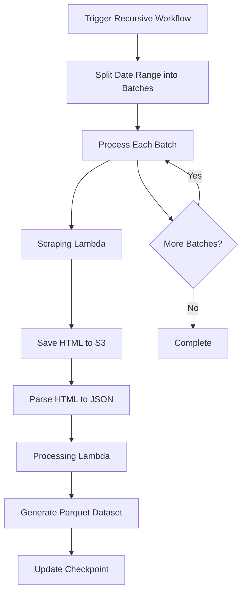

# NC Soccer Data Pipeline

A serverless data pipeline for scraping and processing North Carolina soccer league game data from the EZFacility platform. The system automatically collects game schedules, scores, and related metadata, storing them in both JSON and Parquet formats for analysis.

## Overview

This application scrapes soccer game data from the NC Soccer Hudson EZLeagues platform (`nc-soccer-hudson.ezleagues.ezfacility.com`) and processes it into structured datasets. The pipeline is built using AWS serverless technologies and can handle both real-time daily updates and historical backfills spanning multiple years.

## Architecture

### Technology Stack

#### Scraping Layer
- **BeautifulSoup4**: HTML parsing and data extraction
- **Requests**: HTTP client for fetching web pages
- **Anthropic Claude API**: AI-assisted data extraction for complex parsing scenarios

#### Processing Layer
- **Pandas**: Data transformation and analysis
- **PyArrow**: Efficient Parquet file generation for columnar storage
- **Pydantic**: Data validation and schema enforcement

#### Infrastructure (AWS)
- **AWS Lambda**: Serverless compute for scraping and processing functions
- **AWS Step Functions**: Orchestration of complex workflows with automatic batching
- **Amazon S3**: Storage for HTML, JSON, and Parquet data
- **Amazon EventBridge**: Scheduled triggers for daily updates
- **Amazon ECR**: Container registry for Lambda deployment packages
- **Amazon CloudWatch**: Monitoring, logging, and alerting

#### Development & Deployment
- **Terraform**: Infrastructure as Code for AWS resource provisioning
- **GitHub Actions**: CI/CD pipeline for automated testing and deployment
- **uv**: Fast Python package management
- **Docker**: Containerization for Lambda functions

### Data Architecture

The pipeline uses a partitioned data architecture optimized for time-series queries:

- **Organized directory structure**: Year/month/day partitioning for efficient data retrieval
- **Clear data separation**: Distinct paths for HTML, JSON, and Parquet formats
- **Checkpoint system**: Reliable tracking of processing state and recovery from failures
- **S3 bucket structure**:
  ```
  s3://ncsh-app-data/v2/
  ├── raw/html/year=YYYY/month=MM/day=DD/         # Raw HTML from website
  ├── processed/json/year=YYYY/month=MM/day=DD/   # Parsed JSON data
  ├── processed/parquet/
  │   ├── data.parquet                            # Consolidated dataset
  │   └── processing_results/                     # Batch processing logs
  └── metadata/
      ├── checkpoint.json                         # Processing state
      └── batch_results/                          # Workflow execution results
  ```

### Workflow Architecture

#### 1. Recursive Workflow (Primary)
The main workflow for processing large date ranges with automatic batching and parallel execution.



**Features**:
- Automatic date range splitting (default: 10-day batches)
- Parallel batch processing
- Handles Step Functions 256KB payload limit
- Checkpoint-based recovery
- Idempotent operations

#### 2. Daily Backfill Workflow
Automated daily updates triggered by EventBridge schedules.

**Process**:
1. Triggers at configured time (e.g., 6 AM EST)
2. Scrapes previous day's data
3. Updates cumulative Parquet dataset
4. Sends monitoring metrics

### How Scraping Works

#### 1. URL Generation
The scraper constructs URLs for the EZFacility print view:
```python
https://nc-soccer-hudson.ezleagues.ezfacility.com/print.aspx?
  type=schedule&
  facility_id=690&
  day=MM/DD/YYYY&
  title=Games%20on%20[Date]
```

#### 2. HTML Parsing Strategy
```python
# BeautifulSoup extracts game data from HTML tables
# Two table formats supported:
# - Modern: Uses data-th attributes
# - Legacy: Column position-based parsing

# Extracted fields:
- league_name    # League/division name
- game_date      # Date in YYYY-MM-DD format
- game_time      # Scheduled time or status
- home_team      # Home team name
- away_team      # Away team name
- score          # Final score (if available)
- field          # Venue/field location
- officials      # Referee assignments
```

#### 3. Data Validation
- Schema validation using Pydantic models
- Date range verification
- Duplicate detection
- Missing field handling

#### 4. Error Handling
- Exponential backoff for failed requests (max 3 retries)
- Graceful handling of malformed HTML
- Checkpoint recovery for interrupted processing
- Detailed error logging to CloudWatch

### Processing Pipeline

#### 1. JSON Generation
- Converts raw HTML to structured JSON
- Maintains game metadata
- Preserves original formatting

#### 2. Parquet Dataset Building
- Incremental updates (append mode)
- Columnar storage for efficient queries
- Compression for reduced storage costs
- Schema evolution support

#### 3. Data Quality Checks
- Validates required fields
- Checks date consistency
- Identifies parsing anomalies
- Generates processing reports

## Setup

1. Install dependencies:
```bash
make install
```

2. Run tests:
```bash
make test
```

## Usage

### Running the Recursive Workflow

The recursive workflow processes soccer game data for a specified date range with automatic batching for improved reliability and performance. This workflow can handle large date ranges (e.g., multiple years) efficiently.

```bash
# Process data for a specific date range
python scripts/trigger_recursive_workflow.py --date-range 2021-01-01 2023-12-31

# Optional: Specify batch size (default is 10 days)
python scripts/trigger_recursive_workflow.py --date-range 2021-01-01 2023-12-31 --batch-size 10

# Optional: Force re-scrape of existing data
python scripts/trigger_recursive_workflow.py --date-range 2021-01-01 2023-12-31 --force-scrape

# Optional: Use a specific AWS profile
python scripts/trigger_recursive_workflow.py --date-range 2021-01-01 2023-12-31 --profile your-profile-name

# Process a single date
python scripts/trigger_recursive_workflow.py --date 2023-01-15

# Process an entire month
python scripts/trigger_recursive_workflow.py --month 2023 1
```

#### Local Testing with Workflow Simulator

For development and testing, you can use the local workflow simulator:

```bash
# Process data for a specific day
python scripts/local_workflow_simulator.py --year 2021 --month 1 --day 15 --mode day

# Process data for an entire month
python scripts/local_workflow_simulator.py --year 2021 --month 1 --mode month
```

Local execution stores data in the `./data` directory and execution logs in `./test_output`.

### Parameters Explained

#### Recursive Workflow Parameters

| Parameter | Description |
| --------- | ----------- |
| `--date-range START_DATE END_DATE` | Specifies the start and end dates for data processing in YYYY-MM-DD format. The workflow will process all dates inclusive of both start and end dates. |
| `--date YYYY-MM-DD` | Process a single date. |
| `--month YYYY MM` | Process an entire month (e.g., `--month 2021 3` for March 2021). |
| `--batch-size DAYS` | Number of days to include in each batch. The recursive workflow automatically handles batching for large date ranges. Default is 10 days. |
| `--force-scrape` | Forces the workflow to re-scrape and re-process data even if it already exists in the destination. Without this flag, the workflow skips dates that have already been processed. |
| `--profile PROFILE_NAME` | Specifies the AWS profile to use for authentication. Useful when you have multiple AWS profiles configured. |
| `--bucket BUCKET_NAME` | S3 bucket name (default: ncsh-app-data). |

#### Local Simulator Parameters

| Parameter | Description |
| --------- | ----------- |
| `--year YYYY` | Year to process (required). |
| `--month MM` | Month to process (required). |
| `--day DD` | Day to process (required for day mode). |
| `--mode day\|month` | Process a single day or an entire month. Default is day. |
| `--force-scrape` | Forces re-scraping even if data exists locally. |

### Monitoring Execution

You can monitor workflow execution in the AWS Step Functions console or using the AWS CLI:

```bash
# Check execution status
aws stepfunctions describe-execution --execution-arn <execution-arn>

# For recursive workflows with sub-executions, you can also check the status of child executions
# by looking at the parent execution's output and finding the child execution ARNs
```

### Accessing Processed Data

#### Cloud Execution Data
Processed data is available in both JSON and Parquet formats in the S3 bucket:

- JSON files: `s3://ncsh-app-data/v2/processed/json/year=YYYY/month=MM/day=DD/`
- Parquet dataset: `s3://ncsh-app-data/v2/processed/parquet/data.parquet`
- Processing results: `s3://ncsh-app-data/v2/processed/parquet/processing_results/`

#### Local Execution Data
Processed data is available in the local data directory:

- HTML files: `./data/html/`
- JSON files: `./data/json/`

#### Data Access Examples

```python
# Reading the Parquet dataset with Pandas
import pandas as pd
import boto3

# For S3 data
df = pd.read_parquet('s3://ncsh-app-data/v2/processed/parquet/data.parquet')

# For local data
df = pd.read_parquet('./data/parquet/data.parquet')

# Query specific dates
df_march = df[df['game_date'].str.startswith('2023-03')]
```

### Performance & Scalability

#### Optimization Strategies

1. **Batch Processing**: Automatic splitting of date ranges into optimal batch sizes
2. **Parallel Execution**: Concurrent processing of multiple dates using ThreadPoolExecutor
3. **Connection Pooling**: Reuses HTTP sessions for improved performance
4. **S3 Transfer Optimization**: Uses multipart uploads for large files
5. **Lambda Concurrency**: Configurable concurrent executions (default: 10)

#### Resource Limits

- **Lambda Memory**: 1024 MB for scraping, 2048 MB for processing
- **Lambda Timeout**: 15 minutes per function
- **Step Functions Payload**: 256 KB (handled via S3 storage)
- **Maximum Date Range**: No hard limit (tested with 5+ years)
- **Requests Per Second**: Rate-limited to avoid overwhelming source server

#### Performance Metrics

- **Single Date Scraping**: ~2-5 seconds
- **Monthly Processing**: ~30-60 seconds
- **Yearly Backfill**: ~10-15 minutes
- **Full Historical Load (2007-present)**: ~2-3 hours

### Monitoring & Observability

#### CloudWatch Dashboards

The system includes pre-configured dashboards for:
- Lambda execution metrics
- Step Functions workflow status
- S3 storage usage
- Error rates and alerts

#### Key Metrics

- `ScrapingSuccess`: Success rate of scraping operations
- `GamesScraped`: Total games processed
- `ProcessingDuration`: Time to complete workflows
- `ErrorCount`: Failed executions

#### Logging

All components log to CloudWatch Logs with structured logging:
```python
logger.info(f"Scraped {len(games)} games for {date_str}")
```

Log groups:
- `/aws/lambda/ncsoccer-scraper`
- `/aws/lambda/ncsoccer-processing`
- `/aws/lambda/ncsoccer-utils`

### Development Workflow

#### Local Development

1. **Set up virtual environment**:
   ```bash
   make venv
   make install
   ```

2. **Run tests**:
   ```bash
   make test
   ```

3. **Lint code**:
   ```bash
   make lint
   ```

4. **Format code**:
   ```bash
   make format
   ```

#### CI/CD Pipeline

The GitHub Actions workflow automatically:
1. Validates code changes
2. Runs unit tests
3. Builds Docker images
4. Pushes to Amazon ECR
5. Updates Lambda functions
6. Applies Terraform changes

Deployment is triggered by updating `CHANGELOG.md` with a new version entry.

### Security Considerations

- **IAM Roles**: Least-privilege access for Lambda functions
- **S3 Encryption**: AES-256 server-side encryption
- **VPC Endpoints**: Private connectivity to AWS services
- **Secrets Management**: API keys stored in AWS Secrets Manager
- **Data Retention**: Configurable lifecycle policies

### Cost Optimization

- **S3 Intelligent-Tiering**: Automatic storage class transitions
- **Lambda Reserved Concurrency**: Prevents runaway costs
- **Scheduled Scaling**: Reduced capacity during off-hours
- **Data Compression**: Parquet format reduces storage by ~80%

### Troubleshooting

#### Common Issues

1. **Scraping Failures**:
   - Check CloudWatch logs for HTTP errors
   - Verify source website is accessible
   - Review rate limiting settings

2. **Processing Errors**:
   - Validate JSON schema compatibility
   - Check S3 permissions
   - Review memory allocation

3. **Workflow Timeouts**:
   - Reduce batch size
   - Increase Lambda timeout
   - Check for infinite loops

#### Debug Commands

```bash
# Check recent executions
aws stepfunctions list-executions \
  --state-machine-arn arn:aws:states:us-east-2:xxx:stateMachine:RecursiveWorkflow \
  --max-items 10

# View Lambda logs
aws logs tail /aws/lambda/ncsoccer-scraper --follow

# Test scraper locally
python scripts/direct_scraper.py --year 2023 --month 3 --day 15
```

### Contributing

Contributions are welcome! Please ensure:
1. Tests pass (`make test`)
2. Code is formatted (`make format`)
3. Documentation is updated
4. CHANGELOG.md includes version bump
